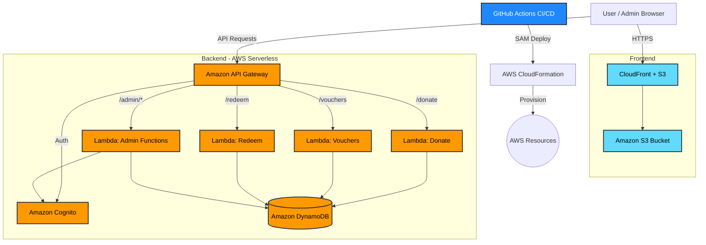
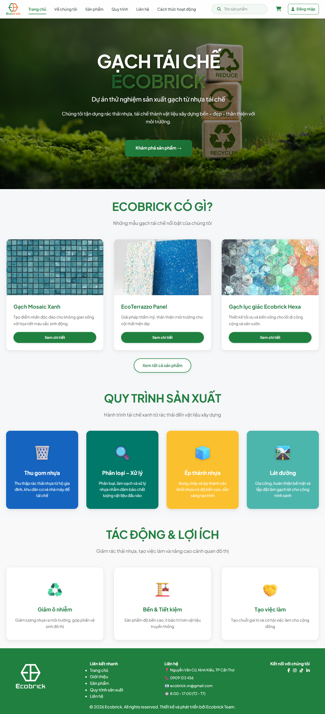
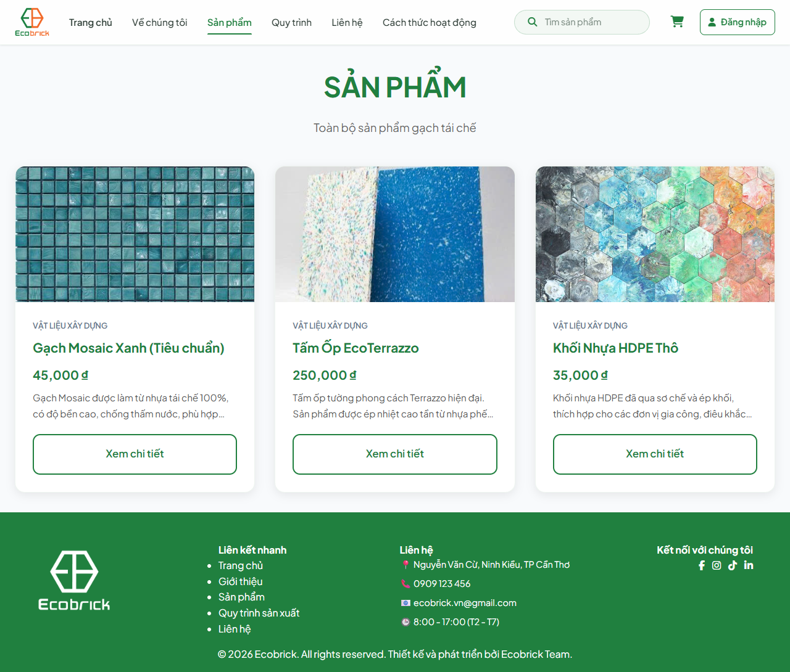
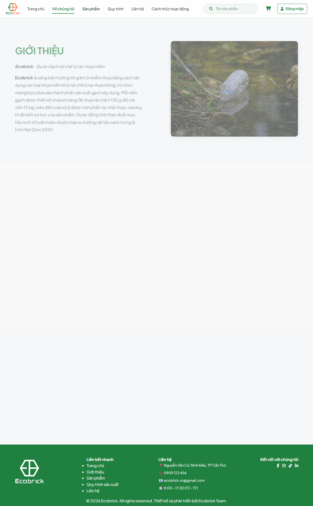
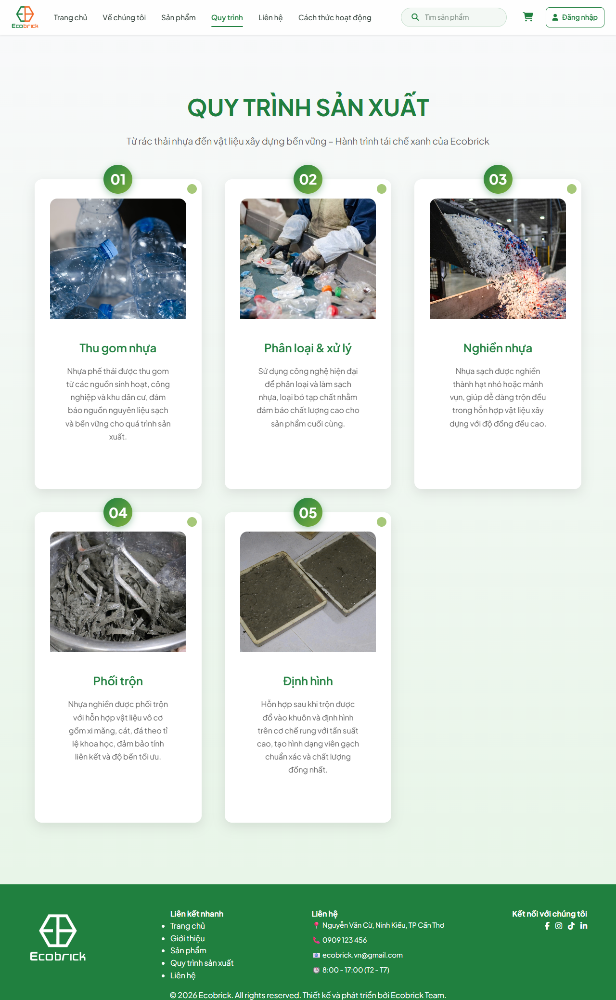
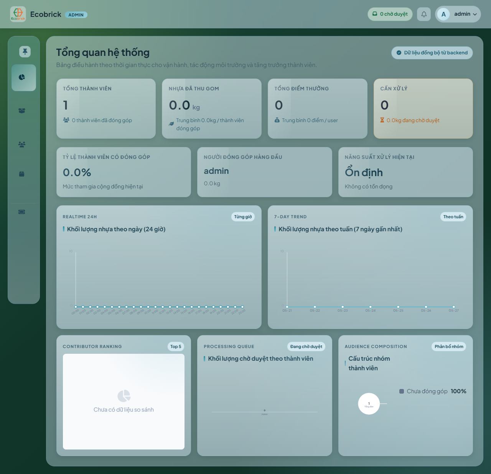

# ♻️ Ecobrick Web (React + TypeScript)

Nền tảng web cho chiến dịch thu gom nhựa đổi ưu đãi (Plastic Reward System). Dự án cung cấp tính năng mua sản phẩm, tích điểm, và quản lý phần thưởng. Hệ thống được xây dựng trên nền tảng Frontend **React + Vite** cùng với Backend **AWS Serverless (Go, API Gateway, DynamoDB, Cognito)**.

## 🌟 Project Overview

Dự án Ecobrick Web đóng vai trò là một điểm chạm giữa người dùng tham gia bảo vệ môi trường và hệ thống đổi thưởng. Cụ thể:
- **Người dùng:** Tìm hiểu về quy trình, xem sản phẩm tái chế, tích luỹ điểm từ việc thu gom nhựa, và quy đổi điểm lấy các Voucher mua sắm.
- **Admin:** Quản lý lượng nhựa thu gom, quản lý người dùng, phân bổ Voucher, và theo dõi các giao dịch điểm thông qua Dashboard.

## ☁️ Cloud & Backend Architecture (AWS Serverless)

Hệ thống được vận hành trên hạ tầng AWS hoàn toàn Serverless thông qua mô hình **GitOps (GitHub Actions + AWS SAM / CloudFormation)**.

<details>
<summary><b>🗺️ Xem sơ đồ Kiến trúc Hệ thống (Mermaid)</b></summary>



</details>

### Vai trò các dịch vụ Đám mây (AWS):
- **Amazon S3 & CloudFront:** Lưu trữ và phân phối Frontend React/Vite.
- **Amazon Cognito:** Quản lý định danh (Authentication & Authorization), lưu trữ thông tin người dùng an toàn.
- **Amazon API Gateway:** Cổng giao tiếp an toàn, kết hợp với Cognito Authorizer.
- **AWS Lambda (Golang):** Đóng vai trò là "Trái tim" của hệ thống xử lý toàn bộ logic nghiệp vụ (BE). Tận dụng tối đa sức mạnh của mô hình phi máy chủ (Serverless), Lambda tự động mở rộng theo lượng người dùng mà không cần quản lý máy chủ vật lý. Các hàm API Serverless (với runtime `provided.al2023` và kiến trúc `arm64`) bao gồm:
  - **Donate Lambda:** Xử lý logic quy đổi nhựa thành điểm thưởng.
  - **Admin Lambda (Award, Users, Donations):** Xử lý mọi nghiệp vụ quản trị phức tạp.
  - **Vouchers & Redeem Lambda:** Xử lý hệ thống đổi quà và trừ điểm theo thời gian thực.
- **Amazon DynamoDB:** Cơ sở dữ liệu NoSQL lưu trữ lịch sử, đơn hàng, người dùng với thiết kế Single-Table Design (`PK`, `SK`) kết nối mượt mà với các Lambda functions.
- **AWS SAM (Serverless Application Model):** Khung ứng dụng định nghĩa toàn bộ hạ tầng Serverless dưới dạng mã (IaC - Infrastructure as Code).

## 💻 Frontend Architecture (React + Vite)

Frontend được phát triển với trọng tâm là hiệu năng và UX:
- **Framework:** React 19 + TypeScript + Vite.
- **Routing:** React Router DOM (v7) quản lý các tuyến đường đa dạng từ Public đến Private (Protected Routes, Admin Routes).
- **Authentication Context:** Tích hợp trực tiếp `aws-amplify` để giao tiếp với AWS Cognito.
- **Quét mã vạch/QR:** Tích hợp `html5-qrcode` & `qrcode.react` cho luồng quy đổi điểm trực tiếp.

## 📸 UI Showcase (Ảnh thực tế)

Dưới đây là một số hình ảnh thực tế về giao diện của trang web:

<details>
<summary><b>1. Trang chủ (Home Page)</b></summary>



</details>

<details>
<summary><b>2. Trang Sản phẩm (Products Page)</b></summary>



</details>

<details>
<summary><b>3. Trang Giới thiệu (About Us Page)</b></summary>



</details>

<details>
<summary><b>4. Trang Quy trình (Process Page)</b></summary>



</details>

<details>
<summary><b>5. Trang Quản trị (Admin Dashboard)</b></summary>



</details>

## 🚀 Prerequisites & Setup

### 1. Cài đặt Backend (Local / AWS)
Chuyển vào thư mục `ecobrich/`:
```bash
cd ecobrich
```
- **Yêu cầu:** AWS CLI, AWS SAM CLI, Golang, Make.
- **Build & Deploy:**
  ```bash
  sam build
  sam deploy --guided
  ```
  Quá trình này sẽ sinh ra các giá trị cần thiết (`ApiEndpoint`, `UserPoolId`, `UserPoolClientId`, `Region`) cho Frontend.

### 2. Cài đặt Frontend (Vite)
Chuyển lại thư mục gốc:
```bash
cd ..
```
- **Yêu cầu:** Node.js (v18+).
- **Cấu hình Môi trường:** Tạo file `.env` từ `.env.example` và điền thông số từ bước Backend:
  ```env
  VITE_API_BASE_URL=<ApiEndpoint>
  VITE_AWS_REGION=<Region>
  VITE_COGNITO_USER_POOL_ID=<UserPoolId>
  VITE_COGNITO_CLIENT_ID=<UserPoolClientId>
  ```
- **Chạy dự án:**
  ```bash
  npm install
  npm run dev
  ```

## 🔄 Deployment Policy (GitOps)

Dự án áp dụng mô hình CI/CD hoàn toàn tự động thông qua **GitHub Actions** (`.github/workflows/deploy.yml`):
- Mỗi khi code được push lên branch `main`, workflow tự động kích hoạt.
- Build Frontend (`npm run build`).
- Triển khai cập nhật Backend và Infra thông qua AWS SAM.
- Yêu cầu các **GitHub Secrets**:
  - `AWS_ACCESS_KEY_ID`
  - `AWS_SECRET_ACCESS_KEY`
  - `AWS_REGION`
